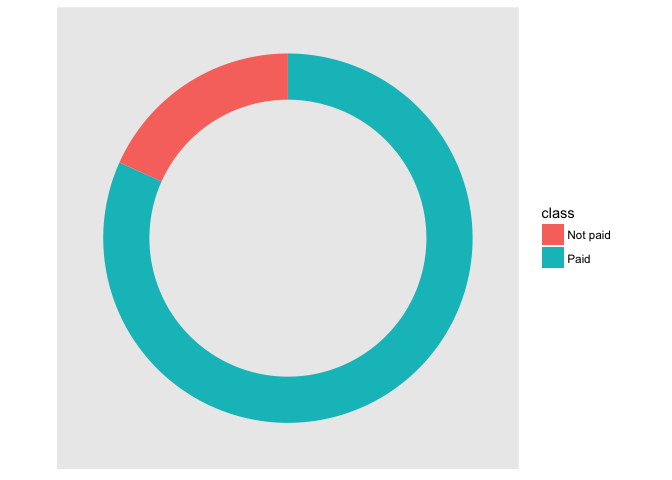

README
================

summary
-------

A series of tree ensembles were trained and evaluated using the {r} \[Lending Club Loan Data\] (<https://www.kaggle.com/wendykan/lending-club-loan-data>). The dataset was divided into a training subset(75%) and a testing subset(25%). The best performing ensemble in terms of accuracy was a C5.0 boost with 15 iterations correctly classifying 91.65% of the examples in the testing set with a Kappa statistic of 0.7126082. Having a sensitivity of 73.96% this model was also the best performer according to this metric. However, in terms of specificity and precision the best model was the Random Forest with 200 trees with values of 99.32% and 89.54% for these metrics.

Methodology
-----------

The goal of this project is fitting a series of decision trees ensembles to loan data in order to assess their predictive performance and upgrade them to a commercial setting.

For this purpose the {r} \[Lending Club Loan Dataset\] (<https://www.kaggle.com/wendykan/lending-club-loan-data>) was used, containing information of 75 variables for 887,379 loans. The variable of interest was if a loan would be fully paid or not. For this purpose we only consider not current loans (254,190 loans) and transformed the loan status variable into a loan result which take the value of "Paid" if a loan has been fully paid and "Not paid" if the loan was either in default or charged off. We assess the frequency of each of the two classes of the new variable and found a class imbalance as 81.71% of the loans belong to the "Paid" class.

Next we selected the relevant variables for training the models. The data subset now consisted of 22 variables, 21 features and the response variable. We randomly divided the data into a training set consisting 75% of the instances (190,642 loans) and the remaining 25% were in the testing set (63,548 loans).

As a first approach we trained an individual tree with the CART algorithm with an optimal complexity parameter tuning using the rpart implementation. This tree had an accuracy of 88.37% and a Kappa statistic of 0.58 in the test set. For the other metrics we take the "Not paid" class as the positive class. In this way, the CART tree obtaineda sensitivity of 60.07%, a specificity of 94.67%, and a precision of 71.49%.

We then trained a second individual tree using the C5.0 algorithm with the C50 package implementation, we evaluated this tree in the test set and obtained an accuracy of 90.30%, a Kappa statistic of 0.66, a sensitivity of 70.43%, a specificity of 94.72%, and a precision of 74.85%.

Then we proceed to train our ensembles. We fitted 5 Adaboost ensembles with 5, 10, 15, 20, and 25 iterations using the Adaboost.M1 algorithm with the fastAdaboost package implementation. Even the best ensemble (with 25 iterations) having an accuracy of 89.89% and a Kappa of 0.65 was outperformed by the individual C5.0 tree.

So we trained 5 C5.0 ensembles with the same number of iterations as the Adaboost ensembles in the next chart we present the accuracy in the test set against the number of iterations.

Where we see that accuracy does not improve after 15 iterations. Hence the optimal boosting model was trained with 15 iterations.

We then trained 5 random forests ensembles with 100, 200, 300, 400, and 500 hundred trees respectively and with parameter m=5. Using the Breiman and Cutler algorithm implementation of the randomForest package. In the next chart we plot the accuracy of the forests against the number of trees.

 The forests didn't perform well in terms of accuracy, as even the best performing forest (with 200 trees) was outperformed by every other model we trained. However, it had a remarkable precision and specificity rates, 89.54% and 99.32%, beating every other model in this metrics.

So we now compare the two best performing models, C5.0 Boost with 15 iterations in terms of accuracy and the Random Forest with 200 trees in terms of precision, to better understand their srengths and weaknesses.

First we compare both confusion matrices with "Not paid" as the positive class. 

We can note that the random forest has more true negative clasifications and less false positive classifications whereas the C5.0 Boost has more true positives and less false negatives. Hence the random forest seems to be better at classifying negative instances (loans which will be paid) as indicated by its higher specificity and its positive predictions are more accurate as indicated by its higher precision; meanwhile, the C5.0 boost is bettter at classifying positive examples as indicated by its higher sensitivity and its negative predictions are more accurate as indicated by its higher negative predictive value. Also recall that the C5.0 has a higher overall accuracy.

We now plot the ROC curve for each model and compute the AUC metric.

We can note that the C5.0 ROC curve dominates the Random Forest ROC curve. Moreover, the AUC for the C5.0 Boost is 0.9620523 meanwhile the AUC for the Random Forest is 0.9552838.

Conclusion
----------

Of all the trees and ensembles trained the top 2 models were the C5.0 Boost and the Random Forest. If overall accuracy is the goal, then the best model is undoubtedly the C5.0 Boost. Whereas if the goal is to avoid fals positives (avoid denying loans to borrowers who would have paid) even at the cost of some overall accuracy (giving loans to borrowers who will not pay) the Random Forest seems a better alternative.
